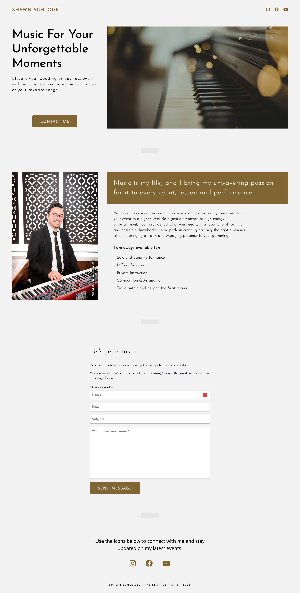

# Theseattlepianist.com

## PROJECT SUMMRARY

This is a website for a local piano business. It is a static site built with HTML, CSS, and JavaScript. It is hosted on netlify.com

## INSTALLATION

1. Clone the repository
2. Run `npm install` to install dependencies
3. Run 'npm run dev' to start the server

## SCREENSHOTS

